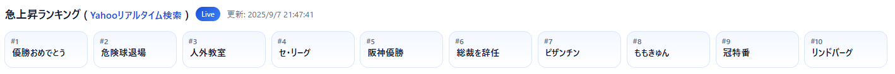
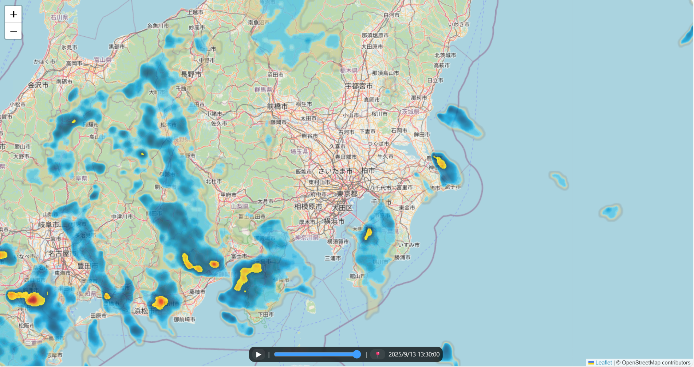
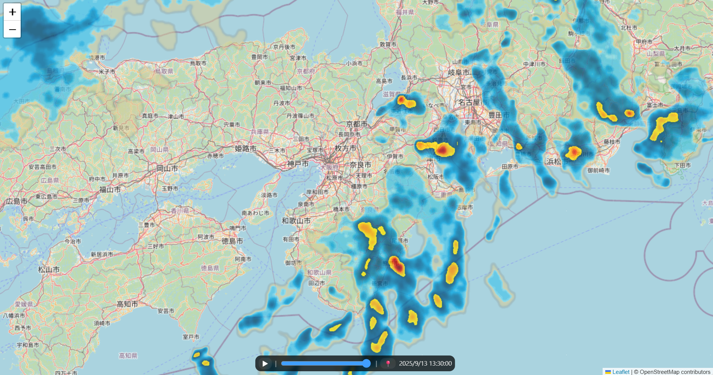

# Notion Integration Tools

This repository manages **HTML widgets that can be embedded into Notion** via GitHub Pages.  
Each HTML file in this repo is self-contained and can be published as a public URL,  
so you can embed it directly into your Notion workspace using the `/embed` block.

---

## Available Widgets

### 1. Stylish Clock
A stylish digital clock with seconds display and multiple timezone support.

**Public URL**  
https://tock99.github.io/Notion-Integration-Tools/stylish_clock.html

**How to Embed into Notion**
1. Open the page in Notion where you want the widget to appear  
2. Type `/embed` and select **Embed**  
3. Paste the public URL above  
4. The clock will be displayed inside Notion ⏰✨

**Preview**  

---

### 2. Yahoo Trending Words Viewer
Display the top 10 keywords from Yahoo! Real-time Search (https://search.yahoo.co.jp/realtime) in a horizontal layout.
Note: These are trend keywords within Japan.

**Public URL**  
https://tock99.github.io/Notion-Integration-Tools/yahoo_trending_words_viewer.html

**How to Embed into Notion**
1. Open the page in Notion where you want the widget to appear  
2. Type `/embed` and select **Embed**  
3. Paste the public URL above  
4. The trending words in yahoo! Real-time Search will be displayed inside Notion ⏰✨

**Preview**  

---

### 3. Weather Radar

Display the rain radar for the current location using RainViewer (https://www.rainviewer.com/).
In Notion, the current location may not be set correctly.
If obtaining the current location fails, display the Kanto–Tokai-Kansai area in Japan instead.

**Public URL**  
https://tock99.github.io/Notion-Integration-Tools/weather_radar.html

**How to Embed into Notion**
1. Open the page in Notion where you want the widget to appear  
2. Type `/embed` and select **Embed**  
3. Paste the public URL above  
4. The rain radar will be displayed inside Notion ⏰✨

**Preview**  

 

**🔧 Optional URL Parameters**

You can customize the radar view by adding query parameters to the URL.

| Parameter | Type / Example | Description |
|-----------|----------------|-------------|
| `ll` | `ll=35.68,139.77` | Latitude,Longitude to center map (Tokyo example). |
| `lat` + `lon` | `lat=35.68&lon=139.77` | Alternative way to specify coordinates (if `ll` not used). |
| `z` | `z=11` | Zoom level (2–18). Default: `7`. |
| `bounds` | `bounds=33.5,135.0,36.5,140.5` | Show map fitted to given SW–NE bounds. Overrides `ll`. |
| `geoloc` | `geoloc=1` (default) / `0` | Whether to try using browser’s current location. |
| `autoplay` | `autoplay=1` | Start animation automatically. Default: `0`. |
| `speed` | `speed=800` | Interval (ms) between frames. Default: `1100`. Range: `200–5000`. |
| `opacity` | `opacity=0.6` | Radar overlay transparency (0–1). Default: `0.75`. |
| `frame` | `frame=last` / `frame=-2` / `frame=3` | Initial frame to display. • `last`: latest • `-2`: 2nd from last • `3`: 3rd frame (0-based). |
| `tz` | `tz=Asia/Tokyo` / `tz=system` | Time zone used in timestamp labels. Default: `Asia/Tokyo`. |
| `hud` | `hud=0` | Hide bottom HUD (play/slider/time). Default: `1` (show). |

 

**💡 Examples**

* Kantou region in Japan  
https://tock99.github.io/Notion-Integration-Tools/weather_radar.html?geoloc=0&bounds=34.5,138.0,37.0,141.5

* Kansai region in Japan  
https://tock99.github.io/Notion-Integration-Tools/weather_radar.html?geoloc=0&bounds=33.5,134.0,35.5,137.5

---

### 4. Google Fit Visualizer

Display your **body weight (kg)** history from **Google Fit** as a clean, embeddable chart.
Works in both **frontend OAuth** and **server (Apps Script) JSON** modes.
If OAuth popups are blocked in Notion, use **server mode**.

**Public URL**
[https://tock99.github.io/Notion-Integration-Tools/google_fit_visualizer.html](https://tock99.github.io/Notion-Integration-Tools/google_fit_visualizer.html)

**How to Embed into Notion**

1. Open the page in Notion where you want the widget to appear
2. Type `/embed` and select **Embed**
3. Paste the public URL above (add query parameters as needed)
4. The weight chart will be displayed inside Notion ✅

 

**🔧 Optional URL Parameters**

You can customize the chart by adding query parameters to the URL.

| Parameter       | Type / Example                                                        | Description                                                                                      |
| --------------- | --------------------------------------------------------------------- | ------------------------------------------------------------------------------------------------ |
| `mode`          | `mode=server` / `frontend` / `auto`                                   | Choose data source mode. Default: `auto` (uses `server` if `endpoint` is set).                   |
| `endpoint`      | `endpoint=https%3A%2F%2Fscript.google.com%2Fmacros%2Fs%2FXXXX%2Fexec` | Apps Script **Web App** URL (URL-encoded recommended). Used in `server`/`auto`.                  |
| `client_id`     | `client_id=YOUR_ID.apps.googleusercontent.com`                        | Google OAuth **Web Client ID**. Used in `frontend`/`auto` when `endpoint` is absent.             |
| `days`          | `days=180`                                                            | Number of days to fetch (7–3650). Default: `90`.                                                 |
| `goal`          | `goal=72`                                                             | Goal weight (kg). Draws a red horizontal line; default y-min becomes `goal-1`.                   |
| `ymin` / `ymax` | `ymin=65&ymax=80`                                                     | Override y-axis min/max (kg). If omitted: min = (`goal`? `goal-1` : dataMin-1), max = dataMax+1. |
| `w`             | `w=720` / `w=100%25`                                                  | Chart width. Number = px; `%`/`auto` allowed. Default: `100%`.                                   |
| `h`             | `h=240`                                                               | Chart height in px. Default: `280`.                                                              |
| `tz`            | `tz=Asia/Tokyo` / `tz=system`                                         | Time zone for labels/tooltip. Default: `Asia/Tokyo`.                                             |
| `ver`           | `ver=0.31`                                                            | Tiny gray version tag shown at the **top-right corner** of the chart.                            |
| `header`        | `header=0`                                                            | Hide the chart header (title & button). Default: `1` (show).                                     |
| `pad`           | `pad=0` / `pad=12`                                                    | Horizontal padding (px). Use `0` to avoid horizontal scrollbars in tight embeds. Default: `12`.  |
| `scroll`        | `scroll=1` / `0`                                                      | Allow page scrollbars. Default: `0` (hide).                                                      |

**Behavior highlights**

* X-axis labels auto-skip to avoid overlap and **always include today**
* Hover tooltip shows `YYYY/MM/DD` and the weight (kg)
* Goal (if set) is shown as a **dashed red line**