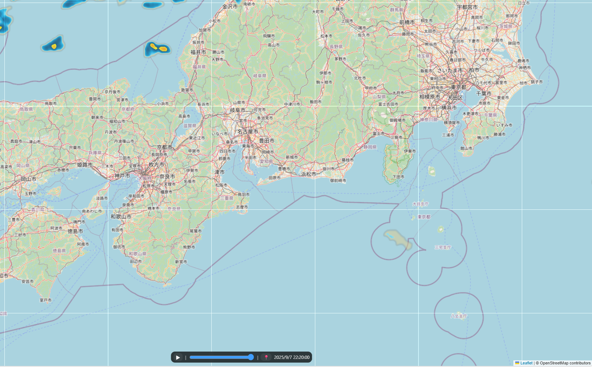

# Notion Integration Tools

This repository manages **HTML widgets that can be embedded into Notion** via GitHub Pages.  
Each HTML file in this repo is self-contained and can be published as a public URL,  
so you can embed it directly into your Notion workspace using the `/embed` block.

---

## Available Widgets

### 1. Stylish Clock
A stylish digital clock with seconds display and multiple timezone support.

**Public URL**  
https://tock99.github.io/Notion-Integration-Tools/stylish_clock.html

**How to Embed into Notion**
1. Open the page in Notion where you want the widget to appear  
2. Type `/embed` and select **Embed**  
3. Paste the public URL above  
4. The clock will be displayed inside Notion ⏰✨

**Preview**  

---

### 2. Yahoo Trending Words Viewer
Display the top 10 keywords from Yahoo! Real-time Search (https://search.yahoo.co.jp/realtime) in a horizontal layout.
Note: These are trend keywords within Japan.

**Public URL**  
https://tock99.github.io/Notion-Integration-Tools/yahoo_trending_words_viewer.html

**How to Embed into Notion**
1. Open the page in Notion where you want the widget to appear  
2. Type `/embed` and select **Embed**  
3. Paste the public URL above  
4. The trending words in yahoo! Real-time Search will be displayed inside Notion ⏰✨

**Preview**  

---

### 3. Weather Radar

Display the rain radar for the current location using RainViewer (https://www.rainviewer.com/).
In Notion, the current location may not be set correctly.
If obtaining the current location fails, display the Kanto–Tokai-Kansai area in Japan instead.

**Public URL**  
https://tock99.github.io/Notion-Integration-Tools/weather_radar.html

**How to Embed into Notion**
1. Open the page in Notion where you want the widget to appear  
2. Type `/embed` and select **Embed**  
3. Paste the public URL above  
4. The rain radar will be displayed inside Notion ⏰✨

**Preview**  

